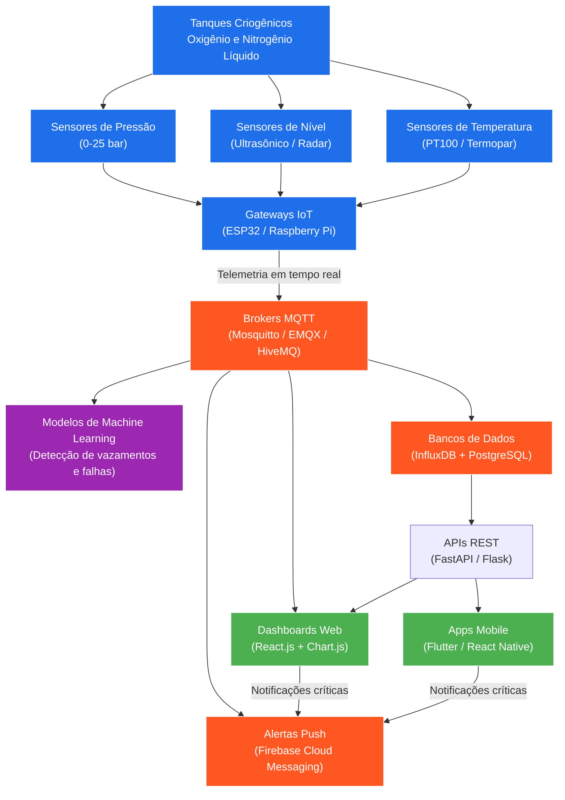

# AI-CryoDiag

**Sistema de IA para diagnóstico e monitoramento de armazenamento criogênico de fármacos gasosos no SUS.**

## 🎯 Motivação

Hospitais e institutos de saúde que armazenam fármacos gasosos em tanques criogênicos de alta capacidade enfrentam um desafio constante: monitorar nível e pressão em tempo real para evitar riscos de segurança e desperdício, além de otimizar a logística de reposição junto aos fornecedores.

Esse projeto nasceu da experiência prática de gestão da rede de criogênicos e fármacos gasosos do **Instituto Nacional de Câncer (INCA/RJ)**, onde um sistema de sensores e alarmes de nível crítico foi parcialmente implementado entre 2015 e 2019. O AI-CryoDiag retoma essa base para propor uma camada de **inteligência artificial** sobre a telemetria — indo do simples alarme para o diagnóstico preditivo.

## 🧊 O que o projeto propõe

- Monitoramento de nível e pressão em tempo real dos tanques
- Detecção antecipada de riscos de segurança (vazamento, queda crítica de nível)
- Machine Learning para prever necessidade de reposição e reduzir custos logísticos
- Foco em unidades de saúde pública (SUS)

## Arquitetura do Sistema

## 🚧 Status

Projeto em desenvolvimento / conceito — baseado em experiência real de campo em gestão hospitalar.

## 👤 Autor

**Acelino Domingos Correia Filho** — ex-gestor de fármacos gasosos e rede de criogênicos do INCA/RJ, hoje dedicado a Data Science e IA aplicada à saúde.
[ResearchGate](https://www.researchgate.net/profile/ACELINO_CORREIA_FILHO2)
