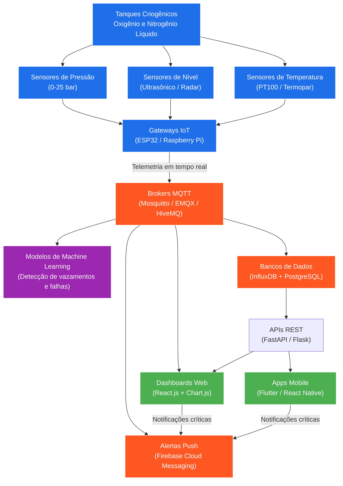

# AI-CryoDiag

**Sistema de IA para diagnóstico em armazenamento criogênico no SUS**
Telemetria + Machine Learning para tanques de gases medicinais (oxigênio e nitrogênio líquido)

---

## 🎯 O Problema

Hospitais e unidades do SUS que armazenam gases medicinais em tanques criogênicos dependem, na maior parte dos casos, de **inspeção manual e periódica** para detectar variações de pressão, nível e temperatura. Isso significa que:

- Vazamentos e falhas silenciosas podem passar despercebidos entre uma ronda e outra
- Não há alerta em tempo real quando um parâmetro sai da faixa segura
- A resposta a uma falha depende de alguém notar o problema fisicamente, muitas vezes já em estágio avançado
- O risco recai diretamente sobre a continuidade do fornecimento de oxigênio a pacientes — um insumo crítico, não um recurso qualquer

Em redes hospitalares de grande porte, essa lacuna de monitoramento contínuo representa risco operacional e risco ao paciente.

## 💡 A Solução

O AI-CryoDiag propõe substituir a inspeção manual por um **sistema de telemetria contínua com detecção inteligente de anomalias**: sensores nos próprios tanques enviam dados em tempo real, um pipeline de dados centraliza essas leituras, e modelos de Machine Learning aprendem o padrão normal de operação para sinalizar desvios — vazamento, queda de pressão, falha de sensor — antes que virem uma emergência.

## 🏗️ Arquitetura do Sistema

**Camadas do sistema:**

| Camada | Componentes | Função |
|---|---|---|
| Física | Sensores de pressão, nível e temperatura | Captação de dados brutos nos tanques |
| Borda (Edge) | Gateways ESP32 / Raspberry Pi | Coleta e envio da telemetria |
| Transporte | Broker MQTT (Mosquitto / EMQX / HiveMQ) | Comunicação em tempo real, baixa latência |
| Armazenamento | InfluxDB (série temporal) + PostgreSQL (dados relacionais) | Histórico de leituras e metadados |
| Inteligência | Modelos de ML | Detecção de anomalias, vazamentos e falhas |
| Aplicação | API REST (FastAPI/Flask), Dashboard (React), App (Flutter/React Native) | Visualização e alertas para a equipe |

## 👤 Por que este projeto

Este projeto nasce da experiência prática de anos de gestão de redes de gases medicinais e criogenia em ambiente hospitalar (INCA/RJ, vinculado ao Ministério da Saúde), incluindo a supervisão direta de manutenção predial e infraestrutura crítica de suporte à vida. O AI-CryoDiag é a tentativa de traduzir esse conhecimento de campo — o que de fato falha, como falha, e o que uma equipe de manutenção precisa saber primeiro — em um sistema de monitoramento inteligente pensado para a realidade do SUS.

## 🗺️ Roadmap

- [x] Definição da arquitetura do sistema
- [ ] Protótipo com 1 sensor real (prova de conceito)
- [ ] Pipeline de ingestão de telemetria (MQTT → InfluxDB)
- [ ] Dashboard básico de visualização
- [ ] Primeiro modelo de detecção de anomalias
- [ ] Piloto em ambiente controlado

## 🛠️ Stack Tecnológica

- **Hardware/Edge:** ESP32, Raspberry Pi
- **Mensageria:** MQTT (Mosquitto, EMQX, HiveMQ)
- **Backend:** FastAPI / Flask
- **Banco de dados:** InfluxDB, PostgreSQL
- **Machine Learning:** detecção de anomalias em séries temporais
- **Frontend:** React.js, Chart.js
- **Mobile:** Flutter / React Native
- **Notificações:** Firebase Cloud Messaging

## 📄 Licença

Este projeto está licenciado sob a licença MIT — veja o arquivo [LICENSE](LICENSE) para detalhes.

## 📬 Contato

Acelino Domingos Correia Filho
[github.com/acelinodomingos](https://github.com/acelinodomingos)
