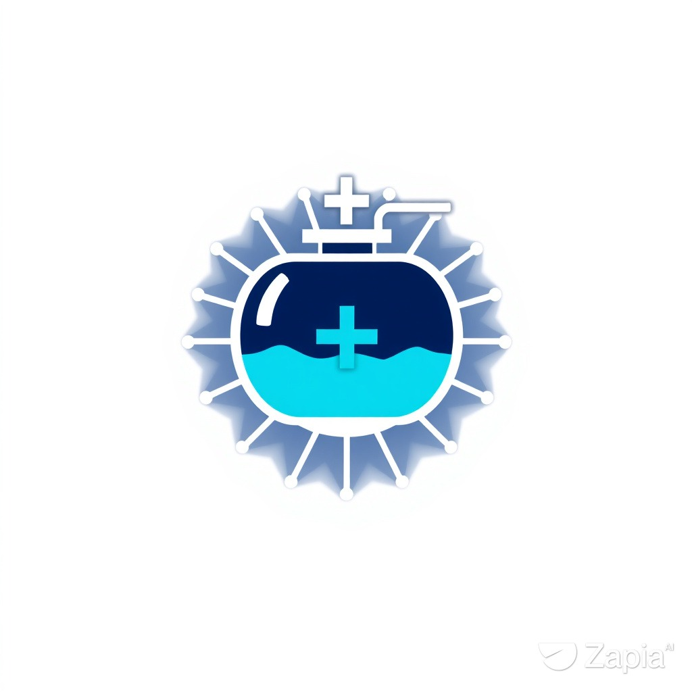
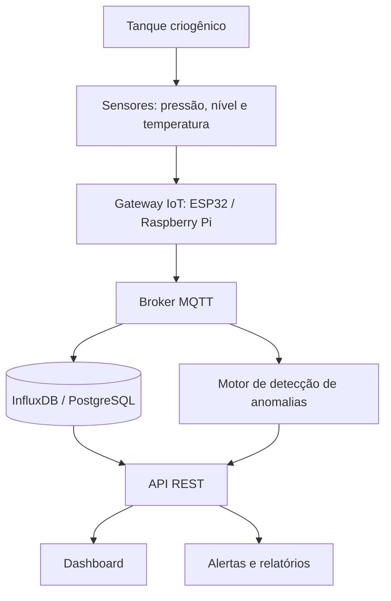

# AI-CryoDiag

<p align="center">
  
</p>

<h3 align="center">Inteligência artificial para diagnóstico em armazenamento criogênico no SUS</h3>

<p align="center">
  Telemetria contínua e Machine Learning para tanques de gases medicinais.
</p>

<p align="center">
  
  
  
</p>

## Sobre o projeto

O AI-CryoDiag é uma proposta de sistema para monitorar tanques criogênicos de oxigênio e nitrogênio líquido em hospitais e unidades do SUS. O objetivo é transformar leituras de pressão, nível e temperatura em informação acionável para as equipes de manutenção e operação.

> **Aviso:** este repositório é um protótipo de pesquisa e desenvolvimento. Não substitui instrumentos certificados, rotinas de segurança, manutenção preventiva ou protocolos hospitalares.

## O problema

A inspeção manual e periódica pode deixar passar vazamentos, falhas de sensores e desvios de operação entre uma ronda e outra. Em uma infraestrutura crítica, a detecção antecipada ajuda a reduzir riscos operacionais e a proteger a continuidade do fornecimento de gases medicinais.

## Solução proposta

- Coleta contínua de pressão, nível e temperatura;
- Comunicação de telemetria por MQTT;
- Armazenamento histórico para análise de séries temporais;
- Detecção de anomalias e possíveis falhas com Machine Learning;
- Dashboard para acompanhamento da operação;
- Alertas para eventos críticos;
- Registro de eventos e apoio à tomada de decisão.

## Arquitetura de referência



## Tecnologias previstas

| Camada | Tecnologias |
|---|---|
| Edge | ESP32, Raspberry Pi |
| Mensageria | MQTT, Mosquitto, EMQX ou HiveMQ |
| Backend | Python, FastAPI ou Flask |
| Dados | InfluxDB e PostgreSQL |
| Machine Learning | Modelos para séries temporais e anomalias |
| Interface | React.js e Chart.js |
| Notificações | Firebase Cloud Messaging |

## Roadmap

- [x] Definição da proposta e da arquitetura de referência
- [x] Documentação inicial do problema e da solução
- [x] Criação da identidade visual do projeto
- [ ] Protótipo com sensor real em ambiente controlado
- [ ] Pipeline MQTT → banco de séries temporais
- [ ] Dashboard de telemetria
- [ ] Modelo inicial de detecção de anomalias
- [ ] Testes de validação e segurança
- [ ] Piloto acompanhado por equipe especializada

## Estrutura planejada

```text
AI-CryoDiag/
├── docs/                 # documentação técnica e operacional
├── data/                 # exemplos anonimizados e dados de teste
├── src/                  # ingestão, API e modelos
├── dashboard/            # interface web
├── tests/                # testes automatizados
├── AI-CryoDiag-logo.png  # identidade visual
├── LICENSE
└── README.md
```

## Origem e propósito

O projeto nasce da experiência prática com gestão de redes de gases medicinais, criogenia e infraestrutura hospitalar crítica. A proposta é aproximar conhecimento de campo, engenharia, ciência de dados e gestão pública para criar ferramentas úteis à realidade do SUS.

## Contribuição

Sugestões, correções e contribuições são bem-vindas. Para propor uma melhoria, abra uma issue descrevendo o problema ou envie um pull request com contexto, testes e documentação quando aplicável.

## Licença

Este projeto está sob a licença MIT. Consulte o arquivo [LICENSE](LICENSE).

## Autor

**Acelino Domingos Correia Filho**  
[github.com/acelinodomingos](https://github.com/acelinodomingos)
